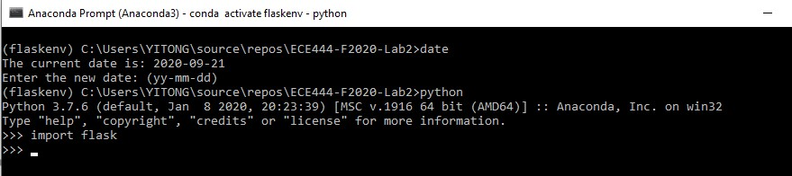
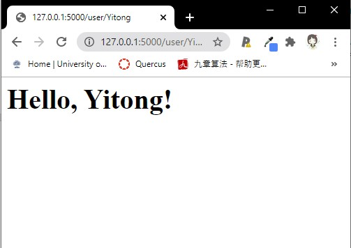

# ECE444-F2020-Lab2
This repo is a clone of https://github.com/miguelgrinberg/flasky

## Activity 1: Installation

## Activity 2: Create hello.py

## Activity 3: Briefly summarize what are the Flask context globals
The flask context globals are variables that are visible to all threads and can be accessed from all threads. 
Flask contains two concepts to manage the global variables: the application context and the request context. 
The context must be activated first before a thread can access a global variable; 
therefore all threads can access a global variable "temporarily" without causing any issues.
